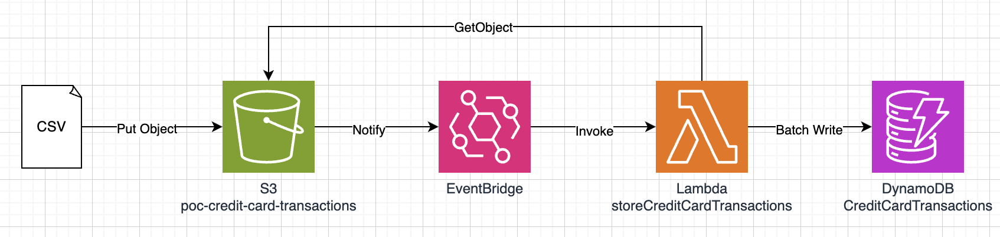

# cc-transaction-store-service

This service saves credit card transaction data in CSV format to a DyanamoDB table:



* CSV files dropped in an S3 bucket trigger an EventBridge notification
* An EventBridge rule triggers the storeCreditCardTransactions Lambda function, which reads the CSV file from S3 and stores each record as a DynamoDB item using the Batch Write API call

CVS files are the the format:
```
Transaction Date,Posted Date,Card No.,Description,Category,Debit,Credit
2022-10-31,2022-10-31,5392,CAPITAL ONE MOBILE PYMT,Payment/Credit,,250.00
2022-10-30,2022-10-31,0697,Amazon.com,Merchandise,245.86,
```

## Requirements

* AWS CLI already configured with Administrator permission
* [Docker installed](https://www.docker.com/community-edition) (optional, for local testing)
* [Golang](https://golang.org)
* SAM CLI - [Install the SAM CLI](https://docs.aws.amazon.com/serverless-application-model/latest/developerguide/serverless-sam-cli-install.html)

## Setup process

### Installing dependencies & building the target 

In this example we use the built-in `sam build` to automatically download all the dependencies and package our build target.   
Read more about [SAM Build here](https://docs.aws.amazon.com/serverless-application-model/latest/developerguide/sam-cli-command-reference-sam-build.html) 

The `sam build` command is wrapped inside of the `Makefile`. To execute this simply run
 
```shell
make
```

## Packaging and deployment

AWS Lambda Golang runtime requires a flat folder with the executable generated on build step. SAM will use `CodeUri` property to know where to look up for the application:

```yaml
...
    FirstFunction:
        Type: AWS::Serverless::Function
        Properties:
            CodeUri: ./
            ...
```

To deploy your application for the first time, run the following in your shell:

```bash
sam deploy --guided
```

The command will package and deploy your application to AWS, with a series of prompts:

* **Stack Name**: The name of the stack to deploy to CloudFormation. This should be unique to your account and region, and a good starting point would be something matching your project name.
* **AWS Region**: The AWS region you want to deploy your app to.
* **Confirm changes before deploy**: If set to yes, any change sets will be shown to you before execution for manual review. If set to no, the AWS SAM CLI will automatically deploy application changes.
* **Allow SAM CLI IAM role creation**: Many AWS SAM templates, including this example, create AWS IAM roles required for the AWS Lambda function(s) included to access AWS services. By default, these are scoped down to minimum required permissions. To deploy an AWS CloudFormation stack which creates or modifies IAM roles, the `CAPABILITY_IAM` value for `capabilities` must be provided. If permission isn't provided through this prompt, to deploy this example you must explicitly pass `--capabilities CAPABILITY_IAM` to the `sam deploy` command.
* **Save arguments to samconfig.toml**: If set to yes, your choices will be saved to a configuration file inside the project, so that in the future you can just re-run `sam deploy` without parameters to deploy changes to your application.

You can find your API Gateway Endpoint URL in the output values displayed after deployment.

### Testing

We use `testing` package that is built-in in Golang and you can simply run the following command to run our tests:

```shell
go test -v ./hello-world/
```
# Appendix

### Golang installation

Please ensure Go 1.x (where 'x' is the latest version) is installed as per the instructions on the official golang website: https://golang.org/doc/install

A quickstart way would be to use Homebrew, chocolatey or your linux package manager.

#### Homebrew (Mac)

Issue the following command from the terminal:

```shell
brew install golang
```

If it's already installed, run the following command to ensure it's the latest version:

```shell
brew update
brew upgrade golang
```
